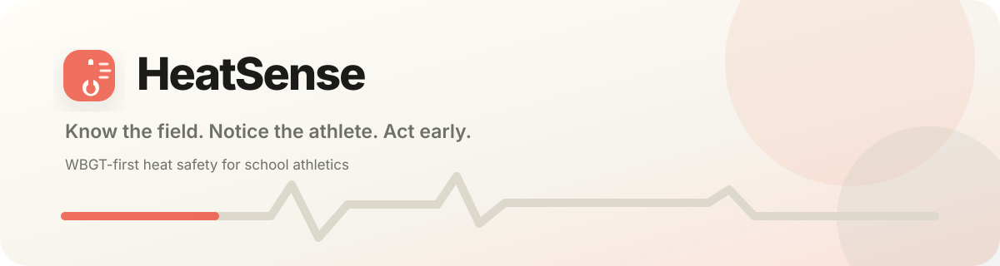
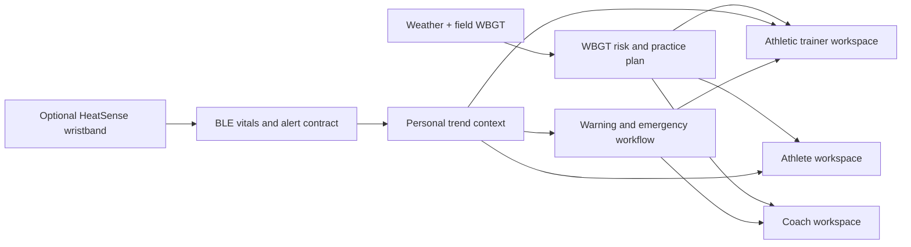

<p align="center">
  
</p>

<p align="center">
  <a href="https://github.com/s-k-28/heatsense"></a>
  
  
  
  <a href="LICENSE"></a>
</p>

<p align="center">
  
</p>

<p align="center">
  <a href="#product">Product</a> ·
  <a href="#current-frontend">Current frontend</a> ·
  <a href="#architecture">Architecture</a> ·
  <a href="#run-locally">Run locally</a> ·
  <a href="#design-review-workflow">Design review</a> ·
  <a href="#roadmap">Roadmap</a>
</p>

## Product

HeatSense is a heat-safety companion for school athletics, being developed for the Congressional App Challenge. Its primary product is a WBGT-based compliance and practice-management app that works without dedicated hardware. It translates field conditions into clear work, rest, hydration, and equipment guidance for coaches, athletic trainers, and athletes.

An optional wristband adds individual context—heart-rate recovery, skin-temperature trend, sweat response, and movement—on top of the team-wide environmental picture.

> [!IMPORTANT]
> The wristband complements WBGT monitoring; it never replaces it. HeatSense is not a medical diagnostic device. Alerts prompt a qualified adult to evaluate an athlete and follow the school emergency action plan.

## Current frontend

The repository currently contains an Expo/React Native frontend prototype in active design iteration. It includes **33 deterministic review routes** across six review groups.

| Experience | What is implemented |
| --- | --- |
| Onboarding | Seven product-education screens plus role-specific setup for coach, athletic trainer, and athlete |
| Coach | WBGT home, practice plan, team roster, alerts, and profile |
| Athletic trainer | Triage home, live monitor, prioritized athlete queue, response protocols, and profile |
| Athlete | Personal home, current status, session analytics, heat-safety education, and profile |
| System states | Stale weather, empty roster, band discovery, no-band mode, and acknowledged alert |
| Drill-downs | Athlete review, alert response, and session analysis with working back navigation |

The interface uses a warm cream/coral visual system, Atkinson Hyperlegible Next, native symbols and controls, reduced-motion support, and role-specific safety information. The UI is not considered final: the next major design pass must make the three role workspaces structurally more distinct instead of reusing one dashboard silhouette.

## Product principles

- **WBGT first.** Environmental guidance is the primary product and remains fully useful without a wristband.
- **Individual context second.** Wearable signals add context relative to an athlete’s baseline.
- **Human evaluation always.** HeatSense elevates risk; it does not diagnose heat illness.
- **Action over decoration.** Every screen should help a user decide, respond, document, or learn.
- **One coherent system.** Cream surfaces, coral brand actions, and semantic safety colors remain consistent across roles.
- **No generic dashboard templates.** Repeated card grids, meaningless gradients, unlabeled charts, and ornamental icon bubbles are explicitly rejected.

## Architecture



The planned wristband firmware follows the same five layers used throughout the product:

```text
hardware → sensor hub → feature extraction → risk engine → output
```

| Firmware area | Planned hardware or behavior |
| --- | --- |
| Controller | ESP32-class controller with BLE |
| Heart signal | MAX30102 heart rate and SpO₂ |
| Skin trend | DS18B20 initially; MLX90614 is a later non-contact option |
| Sweat response | GSR/skin-conductance sensor |
| Movement context | Accelerometer + gyroscope for exertion and collapse detection |
| Athlete output | OLED, vibration motor, and acknowledgement button |
| Power | Approximately 500 mAh LiPo with charging circuit |

Firmware and production BLE integration are intentionally deferred until the frontend, user flows, data contract, and safety language are stable.

## Technology

- [Expo](https://expo.dev/) and [Expo Router](https://docs.expo.dev/router/introduction/)
- React Native and TypeScript
- Atkinson Hyperlegible Next
- Expo UI native controls
- Expo Symbols with cross-platform fallbacks
- React Native Reanimated with Reduce Motion handling
- React Native SVG and Gifted Charts for data visualization
- Expo Linear Gradient and a restrained semantic color system

## Run locally

### Requirements

- Node.js 22.13 or newer
- npm
- Xcode and an iOS Simulator, Android Studio and an emulator, or Expo Go

### Install and start

```bash
git clone https://github.com/s-k-28/heatsense.git
cd heatsense
npm install
npm run ios
```

Other targets:

```bash
npm run android
npm run web
```

If Metro is already running on another port, the screenshot scripts can target it with `HEATSENSE_EXPO_URL`:

```bash
HEATSENSE_EXPO_URL='exp://127.0.0.1:8082/--' npm run screenshots -- /tmp/heatsense-screen-set
```

## Verification

Run the project checks before pushing a UI slice:

```bash
npx tsc --noEmit
npm run lint
npx expo install --check
git diff --check
```

The latest session passed all four checks on September 15, 2026.

## Design review workflow

HeatSense uses a traceable reference-to-implementation loop:

1. Inspect a real adjacent-product pattern from Pinterest, Dribbble, Behance, Mobbin, or a native Apple interaction.
2. Record the source and the exact pattern being borrowed.
3. Adapt the pattern to a HeatSense requirement; do not copy branding or irrelevant content.
4. Render the screen on the target iPhone Simulator.
5. Critique hierarchy, density, accessibility, motion, and safety language.
6. Fix the screen and regenerate the complete review set.

Capture one route:

```bash
./scripts/capture-screen.sh '/dashboard?role=coach&tab=home' /tmp/coach-home.png
```

Capture every route defined in [`design/screen-manifest.json`](design/screen-manifest.json):

```bash
npm run screenshots -- /tmp/heatsense-screen-set
```

The manifest currently produces 33 consistently named frames ready for visual review and later Figma import.

## Repository map

```text
src/app/
  index.tsx                   onboarding
  ready.tsx                   role-specific setup
  dashboard.tsx               five-tab role workspaces
  detail.tsx                  athlete, alert, and session drill-downs
src/components/
  onboarding-visuals.tsx      animated education visuals
  dashboard-content.tsx       role-specific screen content
  dashboard-states.tsx        empty, offline, pairing, and alert states
  dashboard-shell.tsx         shared navigation primitives
  heat-icon.tsx               symbol abstraction
src/constants/theme.ts        color, type, spacing, radius, and motion tokens
design/
  design-tokens.json          portable design tokens
  screen-manifest.json        deterministic route-to-frame inventory
docs/
  ui-product-contract.md      PRD-to-interface contract
  design-reference-map.md     inspiration sources and adaptations
  component-reference-inventory.md
scripts/
  capture-screen.sh           capture one Simulator route
  capture-manifest.mjs        capture the complete review set
```

## Documentation

- [UI product contract](docs/ui-product-contract.md)
- [Design reference map](docs/design-reference-map.md)
- [Component reference inventory](docs/component-reference-inventory.md)
- [Latest agent session handoff](docs/agent-session-handoff-2026-09-15.md)
- [Screen manifest](design/screen-manifest.json)

## Roadmap

- [ ] Give coach, trainer, and athlete workspaces genuinely different page structures while preserving one design system
- [ ] Complete the Figma review board and import all labeled screens
- [ ] Verify all policy copy and thresholds against the official UIL 2026–2027 heat-stress plan
- [ ] Finish authentication, role setup, persistence, permissions, and error handling
- [ ] Integrate a weather provider and implement the WBGT/compliance engine
- [ ] Finalize and version the BLE service, characteristics, UUIDs, and packet schema
- [ ] Prototype ESP32 sensor bring-up and validate each sensor independently
- [ ] Add automated component, navigation, accessibility, and end-to-end tests
- [ ] Prepare the Congressional App Challenge submission story, demo, privacy explanation, and source attribution

The detailed backlog, completed commits, known issues, and next-session order live in the [session handoff](docs/agent-session-handoff-2026-09-15.md).

## Safety and privacy

HeatSense is a safety-support and compliance product, not a medical device. Sample values in the current prototype are illustrative. Production thresholds require field testing and review by qualified school athletic staff. Athlete data sharing must be consent-based, role-limited, and documented before any real deployment.

## Contributing

Keep pull requests focused and include:

- the HeatSense requirement being addressed;
- the reference source and the specific pattern adapted;
- Simulator screenshots before and after the change;
- accessibility and reduced-motion considerations;
- successful TypeScript, lint, Expo dependency, and diff checks.

## License

This repository is distributed under the [MIT License](LICENSE).
